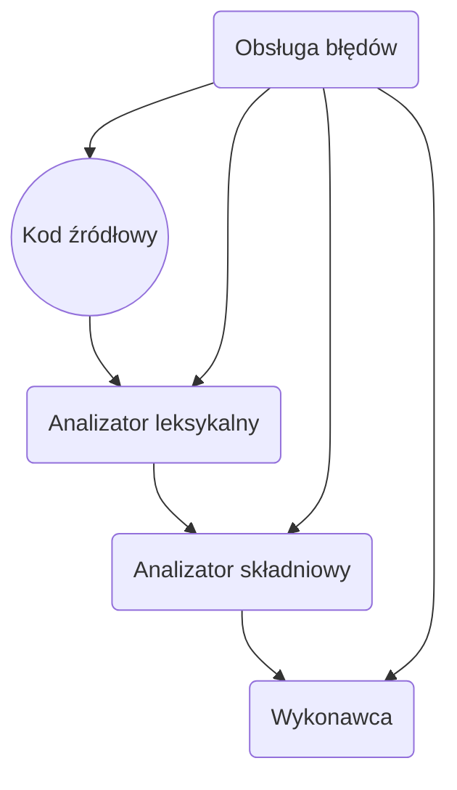

git# Techniki Kompilacji 24L
### Jan Borowy 318364

## Projekt
Celem jest zaprojektowanie języka interpretowanego i implementacja interpretera tego języka.

## Założenia projektowe
Język powinien spełniać narzucone wymagania:
- Interpretowany
- Silne typowanie
- Zmienne domyślnie są niemutowalne.
- Przekazywanie zmiennych do funkcji odbywa się przez referencję.
- Obsługa struktur
- Obsługa rekordu wariantowego

Przyjęte wymagania:
- Język będzie typowany statycznie.
- Zmienne domyślnie są niemutowalne, ale mogą być oznaczone jako mutowalne za
pośrednictwem słowa kluczowego `var`.
- Przykrywanie zmiennych w wypadku konfliktu nazw identyfikatorów.
- Przeciążanie funkcji nie jest możliwe.

## Przykłady wykorzystania języka

Przykładowe programy napisane w języku:
### Suma, punkt wejściowy programu, wyjście standardowe, komentarze
```
/*
    This is an
    example of
    multiline comment
*/
void main() { // main is an entry point of every program
    int a = 2; // Initialize immutable integer
    int b = 2;
    int sum = a + b; // Binary(two argument) addition function
    string str = (2 + 2) as string; // immutable string initialization
    println(str); // Built-in standard output function
}
```

### Niemutowalność i mutowalność

```
void main () {
    int a = 2;
    var int b = 2;
    // a = 3; ERROR!
    b = 3;
}
```

### Twierdzenia warunkowe

```
int main () {
    int a = 2;
    int b = 3;
    if(a % 2 == 0) {
        println("a variable's value is even");
    } else {
        println("a variable's value is uneven");
    }
    return 0;
}
```

### Pętla while
```
void main() {
    var int i = 0;
    while(i < 10) {
        println(i as string);
        i = i + 1;
    }
}
```

### Struktury

```
struct Point {
    float x,
    float y
}

void main() {
    Point point = Point(1.5, 2.25);
    // point.x = 2; ERROR!
    print(point.x as string); // point.x is read-only
}
```

```
struct Person {
    string name,
    string surname
}

struct Book {
    Person author,
    string title
}
```

### Rekord wariantowy

```
struct Person {
    string name,
    string surname
}

struct Book {
    string title,
    string isbn,
    Person author
}

struct Article {
    string headline,
    string shownIn,
    Person author
}

variant Publication {
    Book,
    Article
}

void printPublication(Publication pub) {
    match(pub) {
        Book book -> println("Book with title - " + book.title);
        Article article -> println("Article with headline - " + article.headline);
        default -> println("Unknown publication");
    }
}

void main() {
    Article article = Article("Czy jutro jest niedziela handlowa?", "Gazeta wyborcza", Person("nie wiem", "może"));
    Book book = Book("Kroniki Jakuba Wędrowycza", "123", Person("Andrzej", "Pilipiuk"));
    printPublication(article);
    printPublication(book);
}
```

### Definiowanie funkcji

```
struct IntPoint {
    int ix,
    int iy
}

struct FloatPoint {
    float fx,
    float fy
}

variant Point {
    IntPoint,
    FloatPoint
}

float getCoordinatesSum(Point p) {
    match(p) {
        IntPoint ip -> {
            int sum = ip.ix + ip.iy;
            return sum as float;
        }
        FloatPoint fp -> return fp.fx + fp.fy;
    }
}

void main() {
    FloatPoint fp = FloatPoint(1.5, 2.0);
    IntPoint ip = IntPoint(3, 3);

    println("Float point: " + (getCoordinatesSum(fp) as string));
    println("Int point: " + (getCoordinatesSum(ip) as string));
}
```

### Przykrywanie zmiennych

```
void main() {
    int a = 2;
    if(true) {
        int a = 3;
        println(a as string); // 3
    }
    println(a as string); // 2
}
```

### Rekurencja
```
int getNthFibonacciNumber(int n) {
    if(n == 0 or n == 1) {
        return n;
    }
    return getNthFibonacciNumber(n - 1) + getNthFibonacciNumber(n - 2);
}
```

## Gramatyka języka

```
program                  ::= { definition };
definition               ::= functionDefinition
                           | structureDefinition
                           | variantDefinition;
functionDefinition       ::= functionReturnType identifier "(" parameters ")" block;
structureDefinition      ::= "struct " identifier "{" parameters "}";
variantDefinition        ::= "variant " identifier "{" identifier { "," identifier } "}";
instruction              ::= block
                           | singleStatement
                           | compoundStatement;
block                    ::= "{" { instruction } "}";
singleStatement          ::= (identifierStatement
                           | primitiveInitialization
                           | var
                           | return) ";";
identifierStatement      ::= identifier (arguments // function call
                           | "=" expression // assignment
                           | identifier "=" expression) // non-var user type initialization
compoundStatement        ::= if
                           | while
                           | match;
var                      ::= "var" initialization
initialization           ::= primitiveType identifier "=" expression;
                           | identifier identifier "=" expression;
primitiveInitialization  ::= primitiveType identifier "=" expression;
return                   ::= "return ", [expression];
while                    ::= "while", "(" expression ")", instruction;
functionCall             ::= identifier, arguments;
match                    ::= "match", "(", dotAccess, ")", "{", matchBranch, {matchBranch}, "}";
matchBranch              ::= identifier, identifier, "->" instruction;
                           | "default" "->" instruction;
cast                     ::= sum, ["as", primitiveType];
sum                      ::= multiplication, {additionOperator, multiplication};
multiplication           ::= negation, {multiplicationOperator, negation};
additionOperator         ::= "+"
                           | "-";
multiplicationOperator   ::= "*"
                           | "/"
                           | "%";
negation                 ::= ["!"] factor;
factor                   ::= dotAccess
                           | number // integer or float literal
                           | booleanLiteral
                           | stringLiteral
                           | "(", expression, ")";
dotAccess                ::= identifierOrFunctionCall {"." identifier}
identifierOrFunctionCall ::= identifier ["("[ expression {"," expression } ]")"]
if                       ::= "if" "(" expression ")" instruction [ "else" instruction ];
expression               ::= alternative, {"and", alternative};
alternative              ::= relation, {"or", relation};
relation                 ::= cast, [relationalOperator, cast];
relationalOperator       ::= "=="
                           | "!="
                           | "<"
                           | ">"
                           | "<="
                           | ">=";
arguments                ::= "(", [ expression {"," expression } ], ")";
functionReturnType       ::= "void"
                           | primitiveType
                           | identifier;
parameters               ::= [ variableType, identifier { "," variableType, identifier } ];
variableType             ::= primitiveType
                           | identifier;
primitiveType            ::= "int"
                           | "float"
                           | "string"
                           | "bool";
identifier               ::= identifierFirstCharacter, { digit | letter | "_" };
identifierFirstCharacter ::= "_" | letter;
booleanLiteral           ::= "true"
                           | "false";
stringLiteral            ::= '"'string'"';
string                   ::= { letter
                           | digit
                           | stringLegalWhitespace
                           | otherStringLegalCharacters };
number                   ::= ["-"], nonZeroDigit, {digit}
                          | "0"
                          | ["-"], digit, ".", digit, {digit};
digit                    ::= "0" | "1" | "2" | "3" | "4" | "5" | "6" | "7" | "8" | "9";
nonZeroDigit             ::= "1" | "2" | "3" | "4" | "5" | "6" | "7" | "8" | "9";
stringLegalWhitespace    ::= " ";
letter                   ::= "a" | "b" | "c" | "d" | "e" | "f" | "g" | "h" | "i" | "j" | "k" | "l" | "m" | "n" | "o" | "p" | "q" | "r" | "s" | "t" | "u" | "v" | "w" | "x" | "y" | "z" | capitalLetter
capitalLetter            ::= "A" | "B" | "C" | "D" | "E" | "F" | "G" | "H" | "I" | "J" | "K" | "L" | "M" | "N" | "O" | "P" | "Q" | "R" | "S" | "T" | "U" | "V" | "W" | "X" | "Y" | "Z";
otherStringLegalCharacters ::= "~" | "!" | "@" | "#" | "$" | "%" | "^" | "&" | "*" | "(" | ")" | "-" | "_" | "=" | "+" | "[" | "{" | "]" | "}" | "|" | ";" | ":" | "'" | "," | "<" | "." | ">" | "/"
```

## Podstawowe typy danych
W języku dostępne są cztery podstawowe typy danych:
- Zmienne całkowitoliczbowe `int`
- Zmienne zmiennoprzecinkowe `float`
- Łańcuchy znaków `string`
- Zmienna boolowska `bool`

### Operacje
Dostępne są operatory:
- Operatory dodawania i odejmowania `+ -`
- Operatory mnożenia i dzielenia `* /`
- Operator modulo `%`
- Operatory koniunkcji i alternatywy `and or`
- Operatory równości i nierówności `== != < > <= >=`

Operacje na zmiennych możliwe są tylko wtedy, jeśli po obu stronach operatora zmienne są
tego samego typu. Przy czym:
- Dla zmiennych typu `string` dostępny jest tylko operator `+`, który oznacza konkatenację.
- Dla zmiennych typu `boolean` dostępne są wyłącznie operatory `and or`
- Dla zmiennych typu `int` lub `float` dostępne są operatory `+ - / % > < <= >=`

| Typ zmiennych | Dostępne operatory                |
|---------------|-----------------------------------|
| int, float    | `+` `-` `/` `%` `>` `<` `<=` `>=` |
| boolean       | `and` `or`                        |
| string        | `+`                               |

W przypadku struktur operatory są niedozwolone.

## Funkcje
Funkcje definiuje się w następujący sposób:
``` 
int add(int a, int b) {
    return a + b;
}

void printHello() {
    print("Hello");
    return; // Not required
}
```

`void` to specjalny typ zwracany przez funkcję, który nie zwraca żadnej wartości.
Funkcje niezwracające wartości są nieprawidłowym wyrazem operacji.
np. twierdzenie `add(1, 2) + printHelloWord()` jest błędne.

## Struktury
Struktury to typy danych definiowane przez użytkownika. Zawierają one pola, czyli stałe
wartości dowolnego typu.

### Deklaracja
Wewnątrz definicji struktury mogą znajdować się tylko deklaracje jej pól. Nazwa struktury musi zaczynać się
z wielkiej litery.
```
struct Point {
    float x;
    float y;
}
```

### Inicjalizacja
Inicjalizacja struktury odbywa się poprzez konstruktor `NazwaStruktury(wartościPól...)`.

### Niemutowalność zmiennych
Zmienne wewnątrz struktury są niemutowalne. Wewnątrz deklaracji struktury słowo kluczowe
`var` jest zakazane.

Sama zmienna typu struktury jest mutowalna, może przyjąć inną wartość:
```
struct Point {
    float x;
    float y;
}

int main() {
    var Point p = Point(1.5, 1.25);
    p = Point(1.2, 1.25);
    // p.x = 3.5 ERROR!
}
```

### Struktury zagnieżdżone
Istnieje możliwość dowolnego zagnieżdżania struktur. W przypadku użycia zmiennych przy
inicjalizacji struktur, zmienne są klonowane - wszystkie ich pola są kopiowane i tworzona
jest nowa struktura o identycznych polach.
```
struct Point {
    float x,
    float y
}

struct Vector {
    Point beginning,
    Point end
}


int main() {
    Point beginning = Point(1.5, 1.25);
    Point end = Point(3.5, 0.5);
    Vector force = Point(beginning, end);
}
```

## Konwersja

Konwersja typów odbywa się przez słowo kluczowe `as`.

| Typ 1  | Typ 2  | Konwersja 1 -> 2 | Wynik  |
|--------|--------|------------------|--------|
| int    | float  | `1 as float`     | 1.0    |
| int    | string | `123 as string`  | "123"  |
| float  | int    | `1.5 as int`     | 1      |
| float  | string | `1.5 as string`  | "1.5"  |
| string | int    | `123 as int`     | 123    |
| string | float  | `"1.5" as float` | 1.5    |
| bool   | string | `true as string` | "true" |

#### Uwagi:

- W wypadku błędnej konwersji, zostanie zgłoszony błąd interpretacji i koniec programu, np. konwersja `"abc" as int`.
- Konwersja liczby zmiennoprzecinkowej na całkowitą powoduje zaokrąglenie liczby w dół do liczby jedności.
- Konwersja nie jest dozwolona między strukturami.

## Rekord wariantowy
Typ zmiennej, który przechowuje wartość jednego z wariantów - struktur.

### Deklaracja
Wariant deklaruje się poprzez słowo kluczowe `variant` i wypisane kolejno dostępne warianty:
```
struct IntPoint {
    int ix;
    int iy;
}

struct FloatPoint {
    float fx;
    float fy;
}

variant Point {
    IntPoint,
    FloatPoint
}
```
### Słowo kluczowe match
Rekord wariantowy nie posiada żadnych pól. Należy uprzednio dopasować typ struktury przy
pomocy słowa kluczowego `match`:

```
void printPoint(Point p) {
    match(p) {
        IntPoint intPoint -> print("x: " + ix as string + " y: " + iy as string);
        FloatPoint floatPoint -> print("x: " + fx as string + " y: " + fy as string);
        default -> print("Hard to tell");
    }
}
```
Słowo kluczowe `default` dopasowuje każdy wariant i nie inizcjalizuje zmiennej powiązanej
z wariantem. Należy obsłużyć wszystkie możliwe warianty, inaczej interpretacja kończy się błędem.

## Obsługa błędów
W przypadku błędu interpretacji, program powinien natychmiastowo zakończyć działanie i wskazać adekwatny błąd.
Struktura wiadomości błędu zawiera komunikat czytelny dla człowieka oraz dokładne miejsce w strumieniu
danych, w którym błąd wystąpił. Miejsce określane jest przez linię i kolumnę.

### Przykładowe komunikaty błędu:
- `Error at line 5, col 10: "a.bc" is not convertable.`
- `Error at line 1, col 1: double is not a valid type name.`
- `Error at line 5, col 10: 1 + "abc": operand types do not match`
- `Error at line 150, col 25: structure "Matrix" is undefined`
- `Error at line 120, col 1: function "apply" was not defined`

## Struktura projektu

